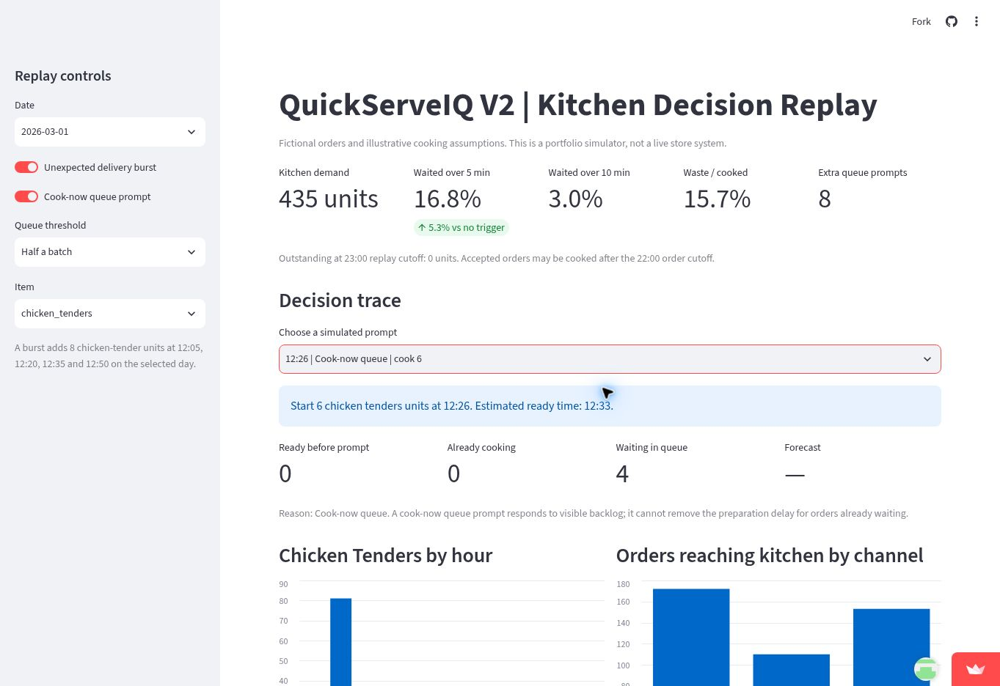
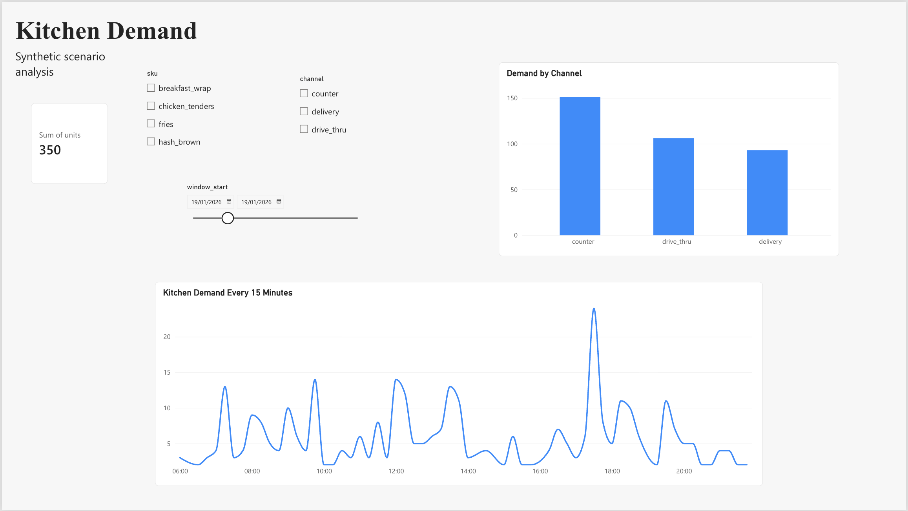
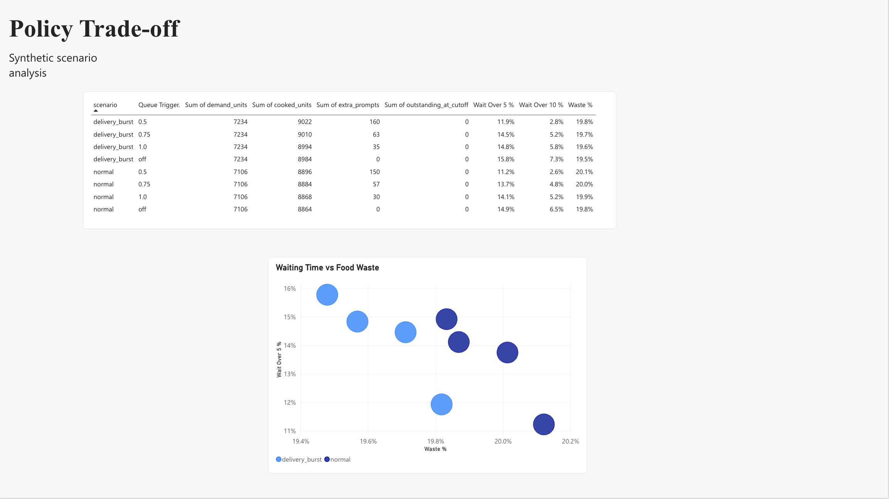

# QuickServeIQ V2 — kitchen decision replay

A reproducible portfolio simulation of cooking decisions in a quick-service kitchen. It turns fictional counter, drive-thru, and delivery orders into 15-minute item demand, forecasts the next window from prior weeks, and replays when batches become ready, are served, or expire. The Streamlit dashboard shows the resulting wait and waste trade-off and explains each cooking prompt.

**Stack:** Python · SQLite/SQL · Streamlit · Pandas · Plotly · CSV exports for Power BI

> All orders and cooking settings are synthetic or illustrative. This is not a live restaurant system, and its results do not measure real-world improvements.

**[Open the live V2 dashboard](https://quickserveiq-operational-dashboard-knyvzmxqbjwgvtueszs7pm.streamlit.app/)**

[Read the two-minute case study](docs/v2/case_study.md) for the decision, simulated results and limitations.



*Example replay: March 1, 2026, with the simulated delivery burst and half-batch queue prompt enabled. The selected chicken-tender decision shows four units waiting.*

## The decision

At each 15-minute check, the simulator compares forecast demand and waiting orders with units already ready or cooking. It may start up to two batches per item. An optional **cook-now queue prompt** starts one additional batch when waiting units reach a selected fraction of a batch and none is already cooking. The dashboard lets you select a day, item, queue threshold, and unexpected delivery burst, then inspect the decision trace.

| Dashboard measure | Meaning |
| --- | --- |
| Kitchen demand | Item units reaching the kitchen during the selected replay. |
| Waited over 5 / 10 min | Share of demanded units fulfilled after a wait longer than the chosen threshold. |
| Waste / cooked | Expired or leftover ready units divided by all cooked units. |
| Extra queue prompts | Additional batches prompted by the optional queue rule. |
| Outstanding at 23:00 | Accepted orders still waiting at the replay cutoff, shown separately from the wait percentages. |

New orders stop before 22:00; the kitchen may continue cooking accepted orders until the 23:00 replay cutoff. A 30-minute hold, item-specific preparation times, and a 20% waste budget are illustrative assumptions.

## Run locally

```bash
git clone https://github.com/Gixii/QuickServeIQ-Operational-Dashboard.git
cd QuickServeIQ-Operational-Dashboard
python3 -m venv .venv
source .venv/bin/activate
python -m pip install -r requirements.txt
python scripts/v2/generate_orders.py
python scripts/v2/build_database.py
python scripts/v2/validate_v2.py
python -m streamlit run dashboard/v2_app.py
```

The data generation is seeded. To reproduce the full policy comparison and refresh BI exports, run:

```bash
python scripts/v2/evaluate_policy.py
python scripts/v2/export_bi.py
```

If you already have a local copy, enter its project folder instead of cloning again. Run the commands from the project root in its existing virtual environment.

## Deploy the V2 dashboard

In [Streamlit Community Cloud](https://share.streamlit.io/), connect the GitHub account that owns this repository and create an app using:

| Setting | Value |
| --- | --- |
| Repository | `Gixii/QuickServeIQ-Operational-Dashboard` |
| Branch | `main` |
| Main file path | `dashboard/v2_app.py` |

The app builds its local SQLite database from the committed synthetic CSVs when it first starts. No database upload or secrets are needed.

## Example replay results

The following results come from the **20 simulated validation days, February 26–March 17, 2026**. Both rows for each scenario use the same 15-minute forecast, no forecast buffer, and a limit of two scheduled batches per check. The optional rule triggers at half a batch.

| Scenario | Half-batch queue prompt | Units waiting >5 min | Waste / cooked | Extra prompts |
| --- | --- | ---: | ---: | ---: |
| Normal | Off | 14.9% | 19.8% | 0 |
| Normal | On | 11.2% | 20.1% | 150 |
| Delivery burst | Off | 15.8% | 19.5% | 0 |
| Delivery burst | On | 11.9% | 19.8% | 160 |

The queue prompt reduces simulated waiting in these replays, but in the normal scenario its waste exceeds the illustrative 20% budget. The burst adds eight chicken-tender units at four lunch times every fifth validation day, without changing forecast history. These are scenario comparisons, not measured store outcomes or an independent holdout test.

## How it is built

```text
Seeded order and item CSVs
    → SQLite tables and 15-minute kitchen-demand SQL view
    → four-week, same-weekday-and-time baseline forecast
    → batch inventory and FIFO order replay
    → Streamlit dashboard and Power BI-ready CSV exports
```

- `scripts/v2/generate_orders.py` creates fictional orders and item lines.
- `scripts/v2/build_database.py` and `sql/v2/01_kitchen_load.sql` create the SQLite layer and demand view.
- `scripts/v2/engine.py` implements forecasts, batches, expiry, backlog, and replay scenarios.
- `scripts/v2/validate_v2.py` checks data reconciliation and replay accounting.
- `dashboard/v2_app.py` exposes scenario controls, metrics, and cooking decisions.
- `scripts/v2/export_bi.py` writes three tables under `data/v2/bi_exports/`. See the [Power BI build guide](docs/v2/powerbi_build_guide.md). A finished `.pbix` report is not included.

For exact definitions, assumptions, and evaluation limits, read the [V2 methodology](docs/v2/README.md). The [original V1 dashboard](dashboard/app.py) remains available with `python -m streamlit run dashboard/app.py`.

<!-- POWERBI-PORTFOLIO-START -->
## SQL and Power BI: Kitchen Operations Analysis

A two-page Power BI report connects kitchen demand analysis with
simulated cooking-policy evaluation. It explores when demand peaks
and how earlier cooking prompts affect waiting times and food waste.

**Data:** Synthetic restaurant orders and simulated kitchen operations.
These findings are scenario results, not measured outcomes from a live
restaurant.

### SQL and reporting workflow

- Loaded order and item-level data into SQLite.
- Aggregated kitchen demand into 15-minute windows by SKU and channel.
- Reconciled 31,836 item units between source records and the
  15-minute demand view.
- Imported kitchen demand, daily item/channel summaries and policy
  evaluation outputs into Power BI.
- Used DAX measures to calculate waiting-time and waste percentages
  from unit counts.

SQL demand aggregation:
[01_kitchen_load.sql](sql/v2/01_kitchen_load.sql)

Report build guide:
[Power BI build guide](docs/v2/powerbi_build_guide.md)

### Page 1 — Kitchen Demand

SKU, channel and date filters support exploration of demand volume,
channel mix and peaks within the day. The screenshot shows
19 January 2026: 350 units, with the busiest 15-minute window
starting at 17:30 and containing 24 units.



### Page 2 — Policy Trade-off

The table and scatter chart compare eight combinations of demand
scenario and queue-trigger setting. They show waiting-time rates,
waste, extra cooking prompts and outstanding demand.

The underlying cooking rule uses a 15-minute forecast, no forecast
buffer and at most two batches per scheduled check. An additional
queue trigger can start one batch when pending demand reaches the
chosen fraction of a batch and no batch is already cooking.



### Findings

During the 26 February–17 March 2026 validation replay:

| Scenario | Queue trigger | Units waiting >5 min | Waste / cooked | Extra prompts |
|---|---|---:|---:|---:|
| Normal | Off | 14.9% | 19.8% | 0 |
| Normal | Half a batch | 11.2% | 20.1% | 150 |
| Delivery burst | Off | 15.8% | 19.5% | 0 |
| Delivery burst | Half a batch | 11.9% | 19.8% | 160 |

The half-batch trigger reduced the share of units waiting more than
five minutes by 3.7 percentage points under normal demand and
3.9 percentage points under delivery bursts. Waste increased by
0.3 percentage points in both scenarios.

This illustrates a service-versus-waste trade-off. Under a strict
20% waste ceiling, the half-batch trigger would miss the target in
the normal scenario, where waste reached 20.1%.

### Interpretation and limitations

- Waiting metrics are unit-based, not percentages of customers or orders.
- Waste is measured as wasted units divided by cooked units.
- Units still outstanding after the simulation's closing clearance
  are reported separately; all eight displayed rows have zero outstanding.
- Extra prompts represent additional simulated cooking instructions,
  not measured staff time.
- Outcomes depend on the assumed preparation times, batch sizes,
  holding limits and demand patterns.
- The final 14-day replay was inspected during development and is
  not an untouched holdout test.
<!-- POWERBI-PORTFOLIO-END -->
